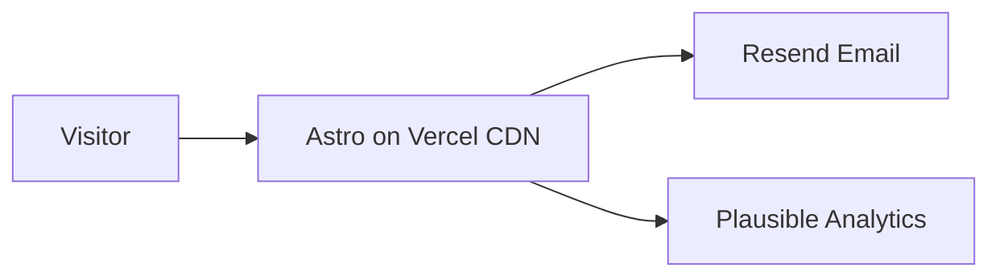
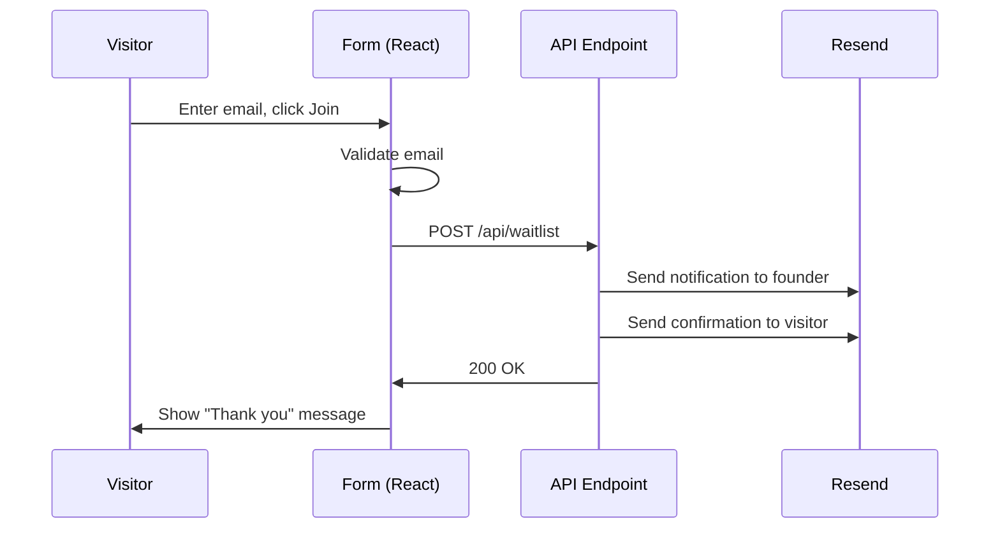

# LaunchPad — Blueprint

> Generated by IAAF on 2026-04-03
> Archetype: Marketing / Landing Page

---

## 1. Project Overview

### Vision
LaunchPad is a marketing landing page for a fictional SaaS product called "LaunchPad" — a tool that helps startups validate ideas faster. The landing page needs to convert visitors into waitlist signups. Single page with multiple sections, plus a pricing page and a contact form.

### Goals
- Achieve 95+ Lighthouse performance score
- Capture waitlist signups with email
- Present the product clearly with strong visual hierarchy
- Ship in one weekend

### Success Metrics
- Page loads in under 1.5 seconds on 3G
- Waitlist form conversion rate > 5%
- Zero JavaScript on non-interactive sections

---

## 2. Tech Stack

| Layer | Technology | Why |
|-------|-----------|-----|
| Framework | Astro 5 | Zero JS by default, perfect for marketing. Fastest option. |
| Language | TypeScript | Type safety even in Astro components |
| Styling | Tailwind CSS v4 | Utility-first, fast development |
| Components | Astro components + React islands | Astro for static sections, React only for forms |
| CMS | MDX files | Dev-managed content, no CMS needed for one page |
| Forms | React Hook Form + Resend | Client validation + server email sending |
| Analytics | Plausible | Privacy-first, no cookie banner needed |
| Hosting | Vercel | Zero-config Astro deploy, edge CDN |
| Package Manager | pnpm | Fast |

---

## 3. Directory Structure

```
launchpad/
  src/
    pages/
      index.astro                  # Landing page
      pricing.astro                # Pricing comparison
      contact.astro                # Contact form page
      thanks.astro                 # Thank you after signup
      404.astro                    # Custom 404
    components/
      layout/
        Header.astro               # Sticky nav bar
        Footer.astro               # Footer with links
        BaseLayout.astro           # HTML wrapper (head, meta, fonts)
      sections/
        Hero.astro                 # Hero with headline, subhead, CTA
        Features.astro             # 3-6 feature cards with icons
        HowItWorks.astro           # 3-step process
        Testimonials.astro         # Social proof cards
        FAQ.astro                  # Accordion FAQ
        CTA.astro                  # Final call-to-action
        Pricing.astro              # Pricing cards
      ui/
        Button.astro               # Button variants
        Card.astro                 # Card component
        Badge.astro                # Tags
      forms/
        WaitlistForm.tsx           # React island — email capture
        ContactForm.tsx            # React island — contact form
    styles/
      globals.css                  # Tailwind base + custom properties
    lib/
      resend.ts                    # Email sending utility
    content/
      faq.json                     # FAQ items
  public/
    fonts/
      inter-var.woff2              # Self-hosted Inter
    images/
      hero-mockup.png              # Product screenshot/mockup
      og-image.png                 # Social sharing image
    favicon.svg
  astro.config.mjs
```

---

## 4. Data Model

No database needed. Waitlist signups are sent directly via Resend email to the founder's inbox. If the list grows, a simple JSON file or Supabase table can be added later.

### Waitlist Signup Flow
```
User enters email → Client validates → POST /api/waitlist → Resend sends notification email to founder + confirmation email to user → Show thank you message
```

---

## 4b. Architecture Diagrams

### System Architecture


### Waitlist Flow


---

## 5. API Design

### Routes Overview
| Method | Path | Description | Auth |
|--------|------|-------------|------|
| POST | /api/waitlist | Submit waitlist email | No |
| POST | /api/contact | Submit contact form | No |

### POST /api/waitlist
**Request:**
```json
{ "email": "user@example.com" }
```

**Response (200):**
```json
{ "success": true }
```

**Validation:** Email must be valid format. Rate limited to 3 requests per IP per minute.

---

## 6. Frontend Architecture

### Pages
| Route | Page | Description |
|-------|------|-------------|
| / | Landing | Hero → Features → How It Works → Testimonials → FAQ → CTA |
| /pricing | Pricing | Free vs Pro vs Enterprise cards |
| /contact | Contact | Contact form with name, email, message |
| /thanks | Thank You | Confirmation after waitlist signup |

### Component Hierarchy (Landing Page)
```
BaseLayout
  Header (sticky)
  main
    Hero (headline, subhead, WaitlistForm, hero image)
    Features (6 cards in 3x2 grid)
    HowItWorks (3 numbered steps)
    Testimonials (3 quote cards)
    FAQ (accordion, 5 items)
    CTA (headline, WaitlistForm)
  Footer
```

### Interactivity Strategy
- **Astro components** for everything static (Hero text, Features, Testimonials, FAQ)
- **React islands** only for forms (WaitlistForm, ContactForm)
- FAQ accordion: CSS-only with `<details>` + `<summary>` (no JavaScript needed)

---

## 7. Design System

### Colors
| Role | Hex | Usage |
|------|-----|-------|
| Primary | #4f46e5 | CTA buttons, links |
| Primary Light | #818cf8 | Hover states, accents |
| Background | #ffffff | Page background |
| Surface | #f8fafc | Feature cards, sections with gray bg |
| Text | #0f172a | Headings, body |
| Muted | #64748b | Secondary text, captions |
| Destructive | #ef4444 | Form errors |
| Success | #22c55e | Form success messages |

### Typography
| Role | Font | Size | Weight |
|------|------|------|--------|
| H1 (Hero) | Inter | 48px (mobile 36px) | 800 |
| H2 (Sections) | Inter | 36px (mobile 28px) | 700 |
| H3 (Cards) | Inter | 20px | 600 |
| Body | Inter | 18px | 400 |
| Small | Inter | 14px | 400 |

### Spacing & Layout
- Spacing scale: 4px base
- Section padding: 96px vertical (mobile 64px)
- Max content width: 1200px
- Border radius: 12px cards, 8px buttons, full for avatars
- Breakpoints: sm 640px, md 768px, lg 1024px

### Component Style
Bold and confident. Large headings, generous whitespace, rounded corners. Subtle gradient on hero section. Cards with light shadow on hover. No heavy borders — clean and open. Color accents on CTAs to draw the eye.

---

## 8. Authentication & Authorization

Not applicable. This is a public marketing site with no user accounts.

---

## 9. Build Order

### Build Efficiency Guidelines
Each step follows this execution pattern to minimize wasted effort and API turns:
1. **READ** all relevant files at the start of each step before writing anything.
2. **PLAN** the complete solution before touching code.
3. **WRITE** the implementation. For simple sub-tasks, write them together in one pass.
4. **TEST** once — if it works, move to the next step.
5. **Do not refactor, polish, or improve passing code.** Move forward.

### Steps

**Step 1: Scaffolding**
`pnpm create astro@latest launchpad`. Install Tailwind CSS integration. Configure `astro.config.mjs` with React integration. Set up `globals.css` with design tokens.

**Step 2: Design System**
Define CSS custom properties in `globals.css`: colors, fonts, spacing. Self-host Inter font (download woff2 to `public/fonts/`).

**Step 3: Layout**
Build `BaseLayout.astro` (HTML head, meta, font loading). Build `Header.astro` (logo, nav links, CTA button — sticky). Build `Footer.astro` (links, copyright).

**Step 4: Landing Page Sections**
Build each section as a self-contained Astro component, one at a time:
1. `Hero.astro` — headline, subheadline, email input placeholder, hero image
2. `Features.astro` — 6 feature cards in responsive grid
3. `HowItWorks.astro` — 3 numbered steps with icons
4. `Testimonials.astro` — 3 quote cards with name, role, company
5. `FAQ.astro` — 5 items using `<details>/<summary>` (CSS-only accordion)
6. `CTA.astro` — final call-to-action with email input placeholder

**Step 5: Waitlist Form**
Create `WaitlistForm.tsx` as React island. Client-side validation (email format). Submit to `/api/waitlist`. Success/error states. Create API endpoint: validate email, send notification via Resend, return success.

**Step 6: Inner Pages**
`pricing.astro` — 3 pricing cards (Free, Pro, Enterprise) with feature comparison.
`contact.astro` — `ContactForm.tsx` React island with name, email, message. API endpoint sends via Resend.
`thanks.astro` — simple thank you page.

**Step 7: SEO**
Add to every page: `<title>`, `<meta description>`, OG tags, canonical URL.
Install `@astrojs/sitemap`. Configure in `astro.config.mjs`.
Add JSON-LD Organization schema to homepage.
Create `public/robots.txt`.

**Step 8: Performance**
Optimize all images (WebP, proper sizing, Astro `<Image>` component).
Verify zero unnecessary JavaScript (check network tab).
Run Lighthouse — target 95+ on Performance, Accessibility, SEO.

**Step 9: Analytics**
Add Plausible script to `BaseLayout.astro` head.

**Step 10: Deploy**
Deploy to Vercel. Configure custom domain. Verify OG images work on social media (Twitter Card Validator, Facebook Debugger).

---

## 10. Environment Setup

### Prerequisites
- Node.js 20+
- pnpm 9+

### Environment Variables
| Variable | Description | Where to Get |
|----------|-------------|--------------|
| RESEND_API_KEY | Email sending | Resend Dashboard → API Keys |
| PUBLIC_PLAUSIBLE_DOMAIN | Analytics domain | Your domain name |

### Initial Setup Commands
```bash
pnpm create astro@latest launchpad
cd launchpad
pnpm astro add react tailwind
pnpm add resend
```

---

## 11. Dependencies

### Core
| Package | Purpose |
|---------|---------|
| astro | Static site framework |
| @astrojs/react | React islands integration |
| @astrojs/tailwind | Tailwind CSS integration |
| @astrojs/sitemap | Auto-generated sitemap |
| react, react-dom | For interactive form islands |
| resend | Email sending API |

### Dev
| Package | Purpose |
|---------|---------|
| typescript | Type safety |
| tailwindcss | Utility-first CSS |
| @playwright/test | E2E smoke tests |

---

## 12. Deployment Strategy

### Hosting
Vercel — zero-config Astro deploy, global CDN, preview deploys.

### CI/CD
Push to `main` → auto-deploy. PR → preview deploy.

### Cache Headers
Static assets: `Cache-Control: public, max-age=31536000, immutable`
HTML pages: `Cache-Control: public, max-age=0, must-revalidate`

---

## 13. Testing Strategy

### E2E Smoke Test (Playwright)
1. All pages load without errors (/, /pricing, /contact, /thanks, /404)
2. Waitlist form: submit valid email → success message
3. Waitlist form: submit invalid email → error message
4. Contact form: submit with all fields → success message
5. All links in header and footer navigate correctly
6. Mobile viewport: hamburger menu works

---

## 14. Skills to Use During Build

| Skill | When to Use | Why |
|-------|-------------|-----|
| /frontend-design | Step 4 (every landing page section) | Distinctive, production-grade sections |
| /ui-ux-pro-max | Step 2 (design system) | Color palette, typography, spacing |
| /seo-audit | Step 7 (SEO) | Full technical SEO audit |
| /humanizer | Step 4 (if writing copy) | Natural-sounding marketing copy |

---

## 15. CLAUDE.md for Target Project

```markdown
# LaunchPad

Marketing landing page for LaunchPad — a tool that helps startups validate ideas faster.

## Commands

- `pnpm dev` — Start dev server
- `pnpm build` — Production build
- `pnpm preview` — Preview production build locally

## Tech Stack

Astro 5 + TypeScript + Tailwind v4 + React islands + Resend + Vercel

## Architecture

### Directory Structure
- `src/pages/` — Astro pages (index, pricing, contact, thanks, 404)
- `src/components/sections/` — Landing page sections (Hero, Features, etc.)
- `src/components/forms/` — React islands for interactive forms
- `src/components/layout/` — Header, Footer, BaseLayout
- `src/lib/` — Resend email utility
- `public/` — Fonts, images, favicon

### Key Patterns
- Astro components for everything static. React islands ONLY for forms.
- Zero JavaScript on non-interactive sections.
- FAQ accordion uses CSS-only `<details>/<summary>`.
- Self-hosted fonts (no Google Fonts CDN).

## Code Organization Rules

1. One component per file.
2. Sections are self-contained — each has its own layout, content, and styles.
3. No JavaScript unless interactivity is required. Use Astro components by default.
4. Images must use Astro `<Image>` component for optimization.

## Design System

### Colors
- Primary: #4f46e5 (CTAs, links)
- Background: #ffffff
- Surface: #f8fafc (gray sections)
- Text: #0f172a
- Muted: #64748b

### Typography
- Font: Inter (self-hosted)
- H1: 48px/800, H2: 36px/700, Body: 18px/400

### Style
- Border radius: 12px cards, 8px buttons
- Section padding: 96px vertical
- Max width: 1200px
- Aesthetic: bold, confident, generous whitespace, subtle shadows on hover

## The Foreman

- Be concise. No sycophantic openers or closing fluff.
- Read existing files before writing code.
- Prefer editing over rewriting.
- Do not re-read files already in context.
- If it works, move to the next step. Do not polish passing code.
- No unsolicited suggestions beyond the current step.
- Optimize for Core Web Vitals during every component build.
- Do not add JavaScript unless interactivity is explicitly required.
- Build each section as a complete, self-contained unit before moving to the next.
- User instructions always override this file.

## Tool Call Awareness

- Read all relevant files at the start of each step, not one at a time.
- Write complete section components in one pass.
- If a step takes more than 15 tool calls, reassess your approach.

## Non-Negotiable Rules

1. Zero unnecessary JavaScript. Astro components by default.
2. Every page has: title, meta description, OG tags, canonical URL.
3. All images optimized (WebP, proper sizing, lazy loading).
4. Mobile-first responsive design.
5. 95+ Lighthouse Performance score.
```

---

## 16. Non-Negotiable Rules

1. **Zero unnecessary JavaScript.** Use Astro components by default. React only for interactive forms.
2. **Every page must have SEO metadata:** title, meta description, OG image, canonical URL.
3. **All images optimized:** WebP format, proper dimensions, lazy loading via Astro `<Image>`.
4. **Mobile-first responsive design.** Base styles for mobile, breakpoints for desktop.
5. **95+ Lighthouse Performance score.** No compromises on page speed.
6. **Self-hosted fonts.** No external font CDN requests.
7. **Accessibility:** All interactive elements keyboard-navigable, proper heading hierarchy, alt text on images.
