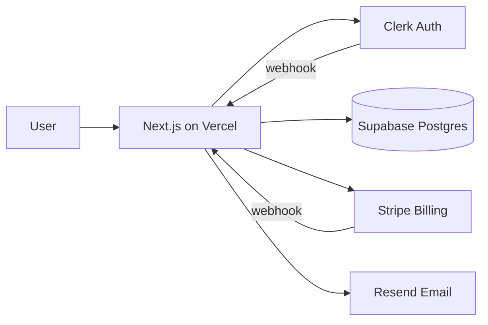
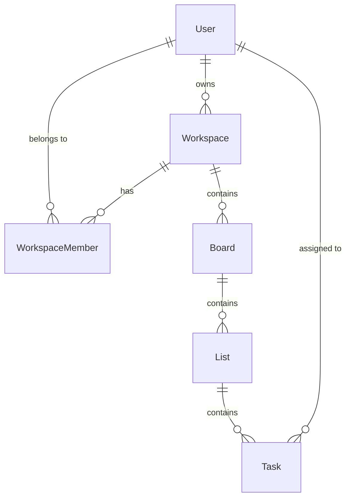
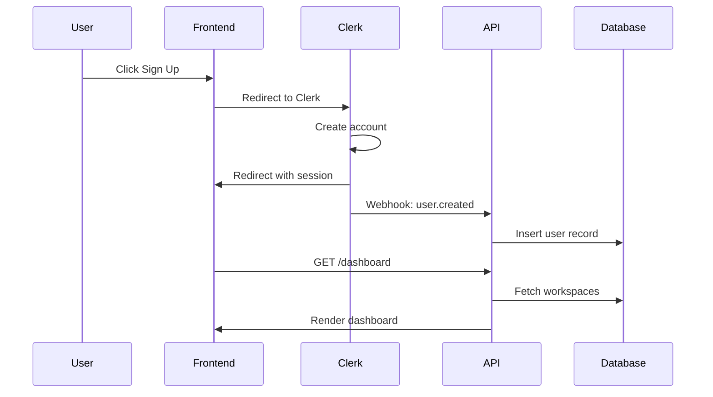
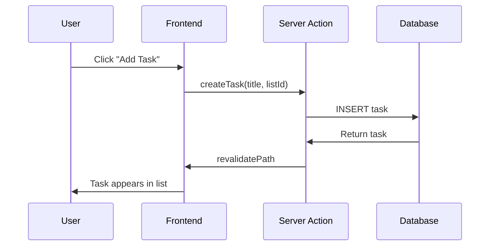

# TaskFlow — Blueprint

> Generated by The Architect on 2026-04-03
> Archetype: SaaS Web App

---

## 1. Project Overview

### Vision
TaskFlow is a collaborative task management application for small teams (2-20 people). Users create workspaces, organize tasks into boards and lists, assign tasks to team members, set due dates, and track progress. Think Trello — but simpler, faster, and focused on small teams who don't need enterprise features.

### Goals
- Ship a functional MVP in 2 weeks
- Support team workspaces with role-based access
- Provide a clean, fast UI that works well on desktop and mobile
- Monetize with a freemium model (free for 1 workspace, paid for unlimited)

### Success Metrics
- Users can create a workspace, invite a teammate, and manage tasks within 5 minutes of signing up
- Page load time under 2 seconds on 3G
- 90%+ Lighthouse score on all pages

---

## 2. Tech Stack

| Layer | Technology | Why |
|-------|-----------|-----|
| Framework | Next.js 15 (App Router) | Full-stack, Server Components for speed, Vercel deploy |
| Language | TypeScript (strict) | Type safety, better DX, fewer runtime errors |
| Styling | Tailwind CSS v4 | Utility-first, fast development, consistent design |
| Components | shadcn/ui | High quality, customizable, accessible primitives |
| Database | Supabase (Postgres) | Auth + DB + Realtime in one service, generous free tier |
| ORM | Prisma | Best DX, visual schema, easy migrations |
| Auth | Clerk | Beautiful UI, org support (workspaces), webhooks, fast setup |
| Payments | Stripe | Industry standard, Checkout + Billing Portal save weeks |
| Email | Resend | Clean API, React Email templates |
| Hosting | Vercel | Zero-config Next.js deploy, preview deploys, edge |
| Package Manager | pnpm | Fast, disk-efficient |

---

## 3. Directory Structure

```
taskflow/
  src/
    app/
      (marketing)/
        page.tsx                   # Landing page
        pricing/page.tsx           # Pricing page
        layout.tsx                 # Marketing layout (navbar + footer)
      (app)/
        dashboard/page.tsx         # Workspace overview — all boards
        board/[id]/page.tsx        # Board view — lists and tasks
        settings/
          page.tsx                 # Workspace settings
          billing/page.tsx         # Billing management
          members/page.tsx         # Team member management
        layout.tsx                 # App layout (sidebar + topbar)
      api/
        webhooks/
          stripe/route.ts          # Stripe webhook handler
          clerk/route.ts           # Clerk user sync webhook
      layout.tsx                   # Root layout
      globals.css                  # Tailwind + design tokens
    components/
      ui/                          # shadcn/ui primitives
      marketing/                   # Landing page sections
      app/
        BoardCard.tsx              # Board preview card
        TaskCard.tsx               # Draggable task card
        TaskList.tsx               # Column of tasks
        TaskDialog.tsx             # Task detail modal
        MemberAvatar.tsx           # Team member avatar
        CreateTaskForm.tsx         # Quick task creation
      shared/
        Logo.tsx
        UserMenu.tsx
    lib/
      supabase/
        client.ts                  # Browser client
        server.ts                  # Server client
      stripe/
        client.ts                  # Stripe instance
        helpers.ts                 # Subscription utilities
      utils.ts                     # cn(), formatDate(), etc.
    types/
      index.ts
  prisma/
    schema.prisma
  public/
    logo.svg
    og-image.png
```

---

## 4. Data Model

### Entities

**User** (managed by Clerk, synced via webhook)
| Field | Type | Notes |
|-------|------|-------|
| id | UUID | PK, from Clerk |
| email | TEXT | Unique |
| name | TEXT | |
| avatar_url | TEXT | From Clerk |
| created_at | TIMESTAMPTZ | Default now() |

**Workspace**
| Field | Type | Notes |
|-------|------|-------|
| id | UUID | PK |
| name | TEXT | |
| slug | TEXT | Unique, URL-friendly |
| owner_id | UUID | FK → User |
| plan | TEXT | free, pro |
| stripe_customer_id | TEXT | |
| subscription_status | TEXT | free, active, past_due, canceled |
| created_at | TIMESTAMPTZ | |

**WorkspaceMember**
| Field | Type | Notes |
|-------|------|-------|
| id | UUID | PK |
| workspace_id | UUID | FK → Workspace |
| user_id | UUID | FK → User |
| role | TEXT | owner, admin, member |
| joined_at | TIMESTAMPTZ | |

**Board**
| Field | Type | Notes |
|-------|------|-------|
| id | UUID | PK |
| workspace_id | UUID | FK → Workspace |
| name | TEXT | |
| position | INTEGER | Sort order |
| created_at | TIMESTAMPTZ | |

**List**
| Field | Type | Notes |
|-------|------|-------|
| id | UUID | PK |
| board_id | UUID | FK → Board |
| name | TEXT | e.g., "To Do", "In Progress", "Done" |
| position | INTEGER | Sort order within board |

**Task**
| Field | Type | Notes |
|-------|------|-------|
| id | UUID | PK |
| list_id | UUID | FK → List |
| title | TEXT | |
| description | TEXT | Optional, markdown |
| assignee_id | UUID | FK → User, nullable |
| due_date | DATE | Nullable |
| priority | TEXT | low, medium, high |
| position | INTEGER | Sort order within list |
| created_by | UUID | FK → User |
| created_at | TIMESTAMPTZ | |
| updated_at | TIMESTAMPTZ | |

### Relationships
- User 1→N Workspace (as owner)
- Workspace N→N User (via WorkspaceMember)
- Workspace 1→N Board
- Board 1→N List
- List 1→N Task
- User 1→N Task (as assignee)
- User 1→N Task (as creator)

---

## 4b. Architecture Diagrams

### System Architecture


### Data Model (ER Diagram)


### Auth Flow


### Core Feature Flow


---

## 5. API Design

### Routes Overview
| Method | Path | Description | Auth |
|--------|------|-------------|------|
| GET | /api/webhooks/stripe | Stripe event handler | Stripe signature |
| POST | /api/webhooks/clerk | Clerk user sync | Clerk signature |

Most data operations use **Server Actions** (not API routes) since frontend and backend are in the same Next.js app.

### Key Server Actions
| Action | Input | What It Does |
|--------|-------|-------------|
| `createWorkspace` | name, slug | Creates workspace + makes user owner |
| `createBoard` | workspaceId, name | Creates board in workspace |
| `createTask` | listId, title, priority? | Creates task in list |
| `moveTask` | taskId, targetListId, position | Moves task between lists |
| `updateTask` | taskId, fields | Updates task fields |
| `deleteTask` | taskId | Soft deletes task |
| `inviteMember` | workspaceId, email, role | Sends invite email, creates pending member |

---

## 6. Frontend Architecture

### Pages / Routes
| Route | Page | Description |
|-------|------|-------------|
| / | Landing | Hero, features, pricing CTA |
| /pricing | Pricing | Free vs Pro comparison |
| /dashboard | Dashboard | All boards in current workspace |
| /board/[id] | Board | Kanban board with lists and tasks |
| /settings | Settings | Workspace name, danger zone |
| /settings/billing | Billing | Stripe billing portal link |
| /settings/members | Members | Invite, remove, change roles |

### State Management
- **Server Components** for all data display (boards, tasks, members)
- **Server Actions** for all mutations (create, update, delete, move)
- **Zustand** for UI state only: sidebar open/closed, active filters, drag state
- **Optimistic updates** via `useOptimistic` for task creation and movement

---

## 7. Design System

### Colors
| Role | Hex | Usage |
|------|-----|-------|
| Primary | #2563eb | Buttons, links, active states |
| Secondary | #7c3aed | Badges, accents |
| Background | #ffffff | Page background |
| Surface | #f8fafc | Cards, panels |
| Text | #0f172a | Body text |
| Muted | #64748b | Secondary text, borders |
| Destructive | #ef4444 | Delete, errors |
| Success | #22c55e | Completed tasks, confirmations |
| Warning | #f59e0b | Due soon, alerts |

### Typography
| Role | Font | Size | Weight |
|------|------|------|--------|
| Headings | Inter | 24-36px | 600-700 |
| Body | Inter | 16px | 400 |
| Small | Inter | 14px | 400 |
| Code | JetBrains Mono | 14px | 400 |

### Spacing & Layout
- Spacing scale: 4px base — 4, 8, 12, 16, 24, 32, 48, 64
- Border radius: 8px default, 12px cards, full for avatars
- Max content width: 1280px
- Sidebar width: 256px (collapsible)

### Component Style
Clean and minimal. Rounded corners, subtle shadows on cards, no heavy borders. Spacious layout with breathing room. Drag-and-drop with smooth animations for task movement.

---

## 8. Authentication & Authorization

### Auth Flow
Sign up (Clerk) → Create first workspace → Dashboard

### Protected Routes
- `/(app)/*` — requires authentication (Clerk middleware)
- `/(marketing)/*` — public
- `/api/webhooks/*` — signature verification only

### Roles & Permissions
| Role | Can Do |
|------|--------|
| Owner | Everything + delete workspace + billing |
| Admin | Manage members, create/delete boards |
| Member | Create/edit/move tasks, view boards |

---

## 9. Build Order

### Build Efficiency Guidelines
Each step follows this execution pattern to minimize wasted effort and API turns:
1. **READ** all relevant files at the start of each step before writing anything.
2. **PLAN** the complete solution before touching code.
3. **WRITE** the implementation. For simple sub-tasks (types, config, validation schemas), write them together in one pass. For complex sub-tasks (auth flows, payment integration), write and test incrementally.
4. **TEST** once — if tests pass, move to the next step immediately.
5. **Do not refactor, polish, or improve passing code.** Move forward.

### Steps

**Step 1: Project Scaffolding**
`pnpm create next-app@latest taskflow --typescript --tailwind --app --src-dir`
Install shadcn/ui (`npx shadcn@latest init`). Configure path aliases. Install Prisma.

**Step 2: Database**
Create Supabase project. Define Prisma schema (User, Workspace, WorkspaceMember, Board, List, Task). Run initial migration. Generate Prisma client.

**Step 3: Auth**
Install Clerk. Configure `ClerkProvider`, `middleware.ts`. Create sign-up/sign-in pages. Set up Clerk webhook at `/api/webhooks/clerk` to sync users to database.

**Step 4: Layouts**
Marketing layout: navbar (Logo, Pricing, Sign In) + footer.
App layout: sidebar (workspace switcher, boards list) + topbar (search, user menu).

**Step 5: Core CRUD — Boards**
Server Actions: createBoard, updateBoard, deleteBoard.
Dashboard page: grid of board cards, "Create Board" button.

**Step 6: Core CRUD — Lists & Tasks**
Board page: display lists as columns, tasks as cards within lists.
Server Actions: createList, createTask, updateTask, moveTask, deleteTask.
TaskDialog: click task card → modal with full details, edit fields, delete.

**Step 7: Drag and Drop**
Install `@hello-pangea/dnd`. Enable drag tasks between lists, reorder tasks within lists, reorder lists within board. Update positions via Server Action.

**Step 8: Team Features**
Members page: list members, invite by email, change roles, remove.
Server Action: inviteMember → sends email via Resend → creates pending member.

**Step 9: Stripe Billing**
Pricing page with Free vs Pro comparison.
Server Action: createCheckoutSession → Stripe Checkout.
Webhook handler: process `checkout.session.completed`, `subscription.updated`, `subscription.deleted`.
Settings/billing: link to Stripe Billing Portal.
Gate features: free plan = 1 workspace max.

**Step 10: Landing Page**
Hero section, features grid, testimonials, pricing CTA. Using marketing layout.

**Step 11: Polish**
Loading states (skeleton for boards, spinner for actions).
Empty states ("No tasks yet — create your first one").
Error boundaries.
Responsive design (mobile sidebar as drawer, stacked lists on mobile).
Toast notifications for actions.

**Step 12: Deploy**
Vercel deployment. Set all environment variables. Configure custom domain. Verify webhooks work in production.

---

## 10. Environment Setup

### Prerequisites
- Node.js 20+
- pnpm 9+
- Supabase account
- Clerk account
- Stripe account (test mode)

### Environment Variables
| Variable | Description | Where to Get |
|----------|-------------|--------------|
| DATABASE_URL | Supabase Postgres connection string | Supabase Dashboard → Settings → Database |
| NEXT_PUBLIC_CLERK_PUBLISHABLE_KEY | Clerk public key | Clerk Dashboard → API Keys |
| CLERK_SECRET_KEY | Clerk secret key | Clerk Dashboard → API Keys |
| CLERK_WEBHOOK_SECRET | Clerk webhook signing secret | Clerk Dashboard → Webhooks |
| STRIPE_SECRET_KEY | Stripe secret key | Stripe Dashboard → Developers → API Keys |
| STRIPE_WEBHOOK_SECRET | Stripe webhook signing secret | Stripe Dashboard → Developers → Webhooks |
| NEXT_PUBLIC_STRIPE_PUBLISHABLE_KEY | Stripe public key | Stripe Dashboard → Developers → API Keys |
| RESEND_API_KEY | Resend email API key | Resend Dashboard → API Keys |
| NEXT_PUBLIC_APP_URL | Public app URL | Your domain (http://localhost:3000 for dev) |

### Initial Setup Commands
```bash
pnpm create next-app@latest taskflow --typescript --tailwind --app --src-dir
cd taskflow
pnpm add @clerk/nextjs @prisma/client stripe resend @hello-pangea/dnd zustand
pnpm add -D prisma
npx prisma init
npx shadcn@latest init
```

---

## 11. Dependencies

### Core
| Package | Purpose |
|---------|---------|
| next | React framework with App Router |
| react, react-dom | UI library |
| @clerk/nextjs | Authentication |
| @prisma/client | Database ORM client |
| stripe | Stripe API client |
| resend | Email sending |
| @hello-pangea/dnd | Drag and drop |
| zustand | Client-side UI state |
| zod | Input validation |

### Dev
| Package | Purpose |
|---------|---------|
| typescript | Type safety |
| prisma | Schema management, migrations |
| tailwindcss | Utility-first CSS |
| vitest | Unit testing |
| @playwright/test | E2E testing |

---

## 12. Deployment Strategy

### Hosting
Vercel — zero-config Next.js deploy, automatic preview deploys on PRs.

### CI/CD
Push to `main` → auto-deploy to production.
PR → preview deploy → review → merge.

### Domain & DNS
Add custom domain in Vercel → configure DNS CNAME record.

---

## 13. Testing Strategy

### Unit Tests
- Vitest for utility functions, server action validation logic

### E2E Tests (Priority)
- Playwright for critical flows:
  1. Sign up → create workspace → create board → create task
  2. Move task between lists
  3. Invite team member
  4. Upgrade to Pro (Stripe test mode)

---

## 14. Skills to Use During Build

| Skill | When to Use | Why |
|-------|-------------|-----|
| /frontend-design | Steps 4, 6, 10 (layouts, board UI, landing page) | Production-grade, distinctive UI |
| /shadcn-ui | Step 1 (scaffolding) | Set up and customize component library |
| /ui-ux-pro-max | Step 4 (layouts) | Design system, color palette |
| /seo-audit | Step 12 (deploy) | Audit landing page SEO |

---

## 15. CLAUDE.md for Target Project

```markdown
# TaskFlow

Collaborative task management app for small teams. Kanban boards with drag-and-drop.

## Commands

- `pnpm dev` — Start development server
- `pnpm build` — Production build
- `pnpm lint` — Run linter
- `pnpm test` — Run Vitest
- `pnpm db:push` — Push Prisma schema to database
- `pnpm db:generate` — Generate Prisma client

## Tech Stack

Next.js 15 + TypeScript + Tailwind v4 + shadcn/ui + Supabase + Prisma + Clerk + Stripe + Vercel

## Architecture

### Directory Structure
- `src/app/(marketing)/` — Public pages (landing, pricing)
- `src/app/(app)/` — Authenticated app (dashboard, boards, settings)
- `src/components/` — UI components (ui/, marketing/, app/, shared/)
- `src/lib/` — Supabase client, Stripe helpers, utilities
- `prisma/` — Database schema and migrations

### Data Flow
- Server Components fetch data directly via Prisma
- Mutations via Server Actions (createTask, moveTask, etc.)
- Optimistic updates with useOptimistic for task operations

### Key Patterns
- Server Components by default. Client Components only for interactivity (drag-and-drop, forms).
- All database queries go through Prisma.
- Clerk middleware in middleware.ts protects /(app)/* routes.
- Stripe webhooks at /api/webhooks/stripe handle subscription lifecycle.

## Code Organization Rules

1. One component per file. Max 300 lines.
2. Path alias: `@/` for `src/` imports.
3. No barrel exports. Import from source file directly.
4. Server Components by default. Only add "use client" for interactivity.
5. Colocate page-specific components next to their page.

## Design System

### Colors
- Primary: #2563eb (buttons, links)
- Secondary: #7c3aed (badges, accents)
- Background: #ffffff
- Surface: #f8fafc (cards)
- Text: #0f172a
- Muted: #64748b
- Destructive: #ef4444
- Success: #22c55e

### Typography
- Font: Inter (headings + body), JetBrains Mono (code)
- Headings: 600-700 weight
- Body: 16px, 400 weight

### Style
- Border radius: 8px default, 12px cards
- Shadows: subtle on cards and dropdowns
- Spacing base: 4px
- Aesthetic: clean, minimal, spacious, smooth animations for drag-and-drop

## The Foreman

- Be concise in output but thorough in reasoning. No sycophantic openers or closing fluff.
- Think before acting. Read existing files before writing code.
- Prefer editing existing files over rewriting them entirely.
- Do not re-read files already in context.
- Test your code before declaring a step complete. If tests pass, move on.
- Do not refactor, polish, or improve code that already passes its tests.
- No unsolicited suggestions beyond the current build step.
- Keep solutions simple. Three similar lines > premature abstraction.
- Return code first. Explanation only if non-obvious.
- When building CRUD operations, write route handler + validation + service logic together.
- User instructions always override this file.

## Tool Call Awareness

- Prefer fewer, larger operations over many small ones.
- Read all relevant files at the start of each build step, not one at a time.
- Write complete files in one operation when possible.
- If a step is taking more than 15 tool calls, reassess your approach.

## Non-Negotiable Rules

1. TypeScript strict mode. No `any` types.
2. All Server Actions validate input with Zod.
3. Never commit .env files.
4. One component per file, max 300 lines.
5. Mobile-first responsive design.
6. Verify Stripe webhook signatures. Always.
7. Soft delete for user-facing data (tasks, boards).

## Environment Variables

| Variable | Description |
|----------|-------------|
| DATABASE_URL | Supabase Postgres connection |
| NEXT_PUBLIC_CLERK_PUBLISHABLE_KEY | Clerk public key |
| CLERK_SECRET_KEY | Clerk secret |
| STRIPE_SECRET_KEY | Stripe secret |
| STRIPE_WEBHOOK_SECRET | Stripe webhook signing |
| RESEND_API_KEY | Email sending |
| NEXT_PUBLIC_APP_URL | Public URL |
```

---

## 16. Non-Negotiable Rules

1. **TypeScript strict mode.** No `any` types. No `@ts-ignore` unless documented why.
2. **All inputs validated with Zod** in Server Actions and API routes.
3. **Never commit `.env` files.** Use `.env.example` with placeholder values.
4. **One component per file.** Max 300 lines. Extract if longer.
5. **Mobile-first responsive design.** Base styles for mobile, breakpoint overrides for desktop.
6. **Verify all webhook signatures.** Stripe and Clerk webhooks must verify signatures before processing.
7. **Soft delete for user data.** Tasks and boards use `deleted_at` field, not hard delete.
8. **Server Components by default.** Only use `"use client"` when the component needs interactivity.
